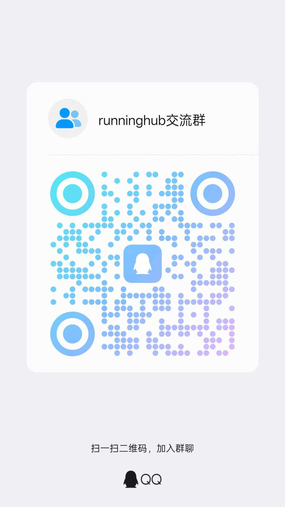

# @difyz9/n8n-nodes-runninghub-client

[](https://www.npmjs.com/package/@difyz9/n8n-nodes-runninghub-client)
[](https://opensource.org/licenses/MIT)

简体中文|[English](README_EN.md) 

这是一个 n8n 社区节点，让您可以在 n8n 工作流中使用 [Runninghub](https://www.runninghub.cn)。

Runninghub 是一个基于云的 ComfyUI 任务执行平台，通过易用的 API 提供强大的 AI 图像/视频生成能力。

[n8n](https://n8n.io/) 是一个采用 [公平代码许可](https://docs.n8n.io/sustainable-use-license/) 的工作流自动化平台。

## 目录

- [安装](#安装)
- [功能操作](#功能操作)
- [凭证配置](#凭证配置)
- [兼容性](#兼容性)
- [使用说明](#使用说明)
- [相关资源](#相关资源)
- [版本历史](#版本历史)

## 安装

请参考 n8n 社区节点文档中的 [安装指南](https://docs.n8n.io/integrations/community-nodes/installation/)。

### 社区节点安装步骤

1. 在您的 n8n 实例中进入 **设置 > 社区节点**
2. 选择 **安装**

3. 在 **输入 npm 包名称** 字段中输入 `n8n-nodes-runninghub-client`
4. 同意风险提示并选择 **安装**
5. 前往 [https://licensestore.org/products/n8n-nodes-runninghub-client](https://licensestore.org/products/n8n-nodes-runninghub-client) 创建或管理本节点的 License Key

安装完成后，**Runninghub Api** 节点将在您的工作流编辑器中可用。

## 功能操作

本节点当前支持 **6 个资源** 下的 **24 个操作**。资源分组现已严格对齐 RunningHub 官方 API 文档的顶层分类。

### 📋 账户（Account）
- **获取账户信息** - 查询账户状态，包括 RH 币余额、正在运行的任务数、钱包余额和 API 类型
- **获取 API Key 列表** - 查询当前账户下的 API Key 列表
- **获取队列状态** - 查询当前 API Key 的队列状态

### 🚀 ComfyUI 工作流（ComfyUI Workflow）
- **创建简易 ComfyUI 任务** - 按 RunningHub 文档中的简易模式直接运行工作流，不传 `nodeInfoList`
- **创建 ComfyUI 任务** - 基于工作流模板创建 ComfyUI 任务
- **查询工作流信息** - 获取工作流的 JSON 配置
- **运行工作流 V2** - 调用 `POST /openapi/v2/run/workflow/{workflowId}` 执行已发布工作流
- **取消 ComfyUI 任务** - 取消正在运行或排队中的 ComfyUI 任务

### 📡 任务查询与 Webhook（Task Query & Webhook）
- **查询任务状态** - 查询任务状态（排队中、运行中、成功、失败）
- **查询任务输出** - 通过旧接口获取任务生成结果
- **查询任务输出 V2** - 通过 v2 查询接口获取任务结果
- **获取 Webhook 详情** - 获取某个任务的 webhook 事件详情
- **重试 Webhook** - 重新发送指定的 webhook 事件

### 🤖 AI 应用（AI App）
- **运行 AI 应用** - 发起 AI 应用任务
- **获取 API 调用示例** - 获取 AI 应用的 API 调用示例代码
- **查询公共模型列表** - 查询 RunningHub 公共模型库资源

### 🧠 标准模型 API（Standard Model API）
- **视频帧率增强** - 结构化调用 `POST /openapi/v2/rhart-video/video-fps-increaser`
- **调用模型 API** - 通过填写 `/openapi/v2/...` 相对路径和 JSON 请求体，调用任意标准模型接口
- **预估模型 API 价格** - 对任意标准模型请求调用 `/openapi/v2/price-preview/...` 进行价格预估
- **文本转语音 Speech 2.8 Turbo** - 结构化调用 `POST /openapi/v2/rhart-audio/text-to-audio/speech-2.8-turbo`，可直接填写音色、情绪、语速、音量、音高等参数
- **视频超分** - 结构化调用 `POST /openapi/v2/rhart-video/video-upscaler`，填写 `videoUrl` 与 `targetResolution`

### 📁 资源上传（Resource Upload）
- **上传文件** - 通过 `/openapi/v2/media/upload/binary` 上传图片、视频、音频或 ZIP 文件（最大 30MB）
  - 返回结果同时包含标准模型 API 可用的 `download_url`，以及 ComfyUI 工作流节点可用的 `fileName`

- **上传资源（弃用）** - 通过旧版 `/task/openapi/upload` 接口上传文件
  - 支持格式：JPG、PNG、JPEG、WEBP（图片），MP4、AVI、MOV、MKV（视频），MP3、WAV、FLAC（音频），ZIP（压缩包）
- **获取 Lora 上传地址** - 获取 Lora 模型文件的上传 URL

## 凭证配置

### 前置条件

1. 在 [https://www.runninghub.cn](https://www.runninghub.cn) 注册 Runninghub 账户
2. 在 RunningHub 账户设置中生成 RunningHub API Key
3. 前往 [https://licensestore.org/products/n8n-nodes-runninghub-client](https://licensestore.org/products/n8n-nodes-runninghub-client) 创建或管理本节点的 License Key

### 在 n8n 中设置凭证

1. 在 n8n 中，进入 **凭证 > 新建**
2. 搜索 **Runninghub Api**
3. 输入在 RunningHub 生成的 **RunningHub API Key**
4. 输入从 [License Store](https://licensestore.org/products/n8n-nodes-runninghub-client) 获取的 **License Key**
5. 点击 **保存**

### 测试凭证

凭证配置包含内置测试功能，会通过调用账户状态端点来验证您的 API 密钥是否有效。

### License Key 与在线校验

本节点除 RunningHub API Key 外，还需要配置有效的 License Key。尚未获取 License Key 时，请前往官方产品页创建：[https://licensestore.org/products/n8n-nodes-runninghub-client](https://licensestore.org/products/n8n-nodes-runninghub-client)。

节点在真正发起 RunningHub 请求之前，会通过托管校验端点 `https://open.licensestore.org/v1/license/check` 执行在线 License 校验。校验请求会发送 n8n 的 `instanceId`、`instanceBaseUrl`、当前选择的 `resource`、`operation`，以及当前 RunningHub API Key 的哈希值，用于 License 绑定和短租约续期。

内置的凭证测试仍然只验证 RunningHub API Key；license 是否有效会在节点执行时校验。

## 兼容性

- **最低 n8n 版本**: 1.0.0
- **测试版本**: n8n 1.0.0+
- **节点 API 版本**: 1

本节点已在最新版本的 n8n 上测试并兼容。

## 使用说明

### 基础工作流示例

以下是创建 ComfyUI 任务并获取结果的简单工作流：

1. **添加 Runninghub Api 节点** 到工作流
2. **选择资源**: ComfyUI Workflow
3. **选择操作**: Create ComfyUI Task
4. **输入工作流 ID**: 您的 ComfyUI 工作流模板 ID
5. **可选自定义节点参数**: 启用"Send NodeInfo List"
6. **添加另一个 Runninghub Api 节点** 用于轮询任务完成状态
7. **选择资源**: Task Query & Webhook
8. **选择操作**: Query Task Output
9. **使用任务 ID**: 从上一个节点获取

### 使用节点参数

创建任务时，可以通过 `nodeInfoList` 字段自定义节点参数：

```json
[
  {
    "nodeId": "6",
    "fieldName": "text",
    "fieldValue": "山间美丽的日落"
  },
  {
    "nodeId": "3",
    "fieldName": "seed",
    "fieldValue": "12345"
  }
]
```

### 简易与高级 ComfyUI 任务

当你只是想按 RunningHub 文档中的“简易模式”直接运行工作流时，可使用 `Create ComfyUI Task Simple`。该操作只提交 `workflowId`，并可选附带 `addMetadata` 与 `accessPassword`。

### 高级 ComfyUI 任务参数

`Create ComfyUI Task` 现在也暴露了在线文档中的高级参数，包括 `accessPassword`、`addMetadata`、`webhookUrl`、`workflow` JSON 覆盖、`instanceType`、`usePersonalQueue` 和 `retainSeconds`。

### 已发布工作流 V2 接口

当 RunningHub 在线文档展示的是 `/openapi/v2/run/workflow/{workflowId}`，而不是旧的 `/task/openapi/create` 时，请使用 `ComfyUI Workflow` 资源下的 `Run Workflow V2`。

这个操作会：

1. 通过 Bearer 鉴权调用 `POST /openapi/v2/run/workflow/{workflowId}`
2. 复用现有的 `nodeInfoList` JSON / Structured Items 两种输入方式
3. 返回任务信息后，通常应继续配合 `Task Query & Webhook -> Query Task Output V2` 轮询最终结果

### ComfyUI 工作流结构化编辑

`Create Task` 现在支持两种 `nodeInfoList` 输入方式：

1. `JSON` 模式：直接粘贴完整 `nodeInfoList` 数组
2. `Structured Items` 模式：逐条填写 `nodeId`、`fieldName` 和带类型的 `fieldValue`

`Query Workflow Info` 也支持解析返回的工作流 `prompt`，并在输出中附加 `nodeInfoListPreview`，便于先查看工作流里哪些 `inputs` 字段适合拿来构造 `nodeInfoList`，再调用 `Create ComfyUI Task` 或 `Run Workflow V2`。

如果你只想拿到模板数组、不需要原始 workflow JSON，可以直接使用 `Get Workflow Prompt Template`。这个 operation 会按指定 `workflowId` 返回一个最小化的 `nodeInfoListTemplate` 结果。

当开启 prompt 解析时，返回结果还会额外包含：

1. `workflowPromptFields.system_prompt_fields`
2. `workflowPromptFields.prompt_fields`
3. `workflowPromptFields.negative_prompt_fields`
4. `nodeInfoListTemplate`，可直接作为 `nodeInfoList` 模板复制到任务请求中
5. `workflowPromptNodeInfoList`，其中 `promptKind` 取值为 `system`、`prompt` 或 `negative`

示例：

```json
{
  "nodeInfoListTemplate": [
    {
      "nodeId": "30",
      "fieldName": "prompt",
      "fieldValue": "主体：延时摄影下，荧光蘑菇群落每 30 秒同步亮起..."
    },
    {
      "nodeId": "19",
      "fieldName": "negative_prompt",
      "fieldValue": "色调艳丽，过曝，静态，细节模糊不清..."
    }
  ],
  "workflowPromptFields": {
    "system_prompt_fields": [
      {
        "node_id": "564",
        "field_name": "text",
        "class_type": "CLIPTextEncode",
        "meta_title": "System Prompt",
        "current_value": "You are a cinematic video director..."
      }
    ],
    "prompt_fields": [
      {
        "node_id": "566",
        "field_name": "text",
        "class_type": "CLIPTextEncode",
        "meta_title": "Positive Prompt",
        "current_value": "A woman turns back and looks at the camera..."
      }
    ],
    "negative_prompt_fields": [
      {
        "node_id": "328",
        "field_name": "text",
        "class_type": "CLIPTextEncode",
        "meta_title": "Negative Prompt",
        "current_value": "worst quality, watermark, subtitles..."
      }
    ]
  },
  "workflowPromptNodeInfoList": [
    {
      "nodeId": "564",
      "fieldName": "text",
      "fieldValue": "You are a cinematic video director...",
      "promptKind": "system"
    }
  ]
}
```

### 通用标准模型调用

当在线文档里有新的标准模型接口、但节点里还没有独立操作时，可直接使用 `Standard Model API` 资源：

1. 选择 **资源**: Standard Model API
2. 选择 **操作**: Run Model API 或 Preview Model API Price
3. 填写 `/openapi/v2` 之后的接口路径，例如 `kling-video-o3-std/video-edit`
4. 按官方文档粘贴对应的 JSON 请求体

### 标准模型 API 的结构化操作

当你不想手写标准模型 API 的 JSON 请求体时，可以直接使用 `Standard Model API` 资源中的预置表单：

1. 选择 **资源**: Standard Model API
2. 选择 **Upscale Video**、**Increase Video FPS** 或 **Text To Audio Speech 2.8 Turbo**
3. 视频类接口可直接传公网视频 URL，或复用 `Upload File` 返回的 `download_url`
4. 文本转语音接口可直接填写音色、情绪、语速、发音词典等结构化字段

### 文件上传示例

上传图片用于工作流：

1. **添加 Runninghub Api 节点**
2. **选择资源**: Resource Upload
3. **选择操作**: Upload File（上传文件）
4. **输入文件路径** 或从上一个节点引用
5. **使用返回的 fileName** 在任务的 nodeInfoList 中，或把 `download_url` 用于标准模型 API 请求

只有在明确需要旧版 `/task/openapi/upload` 接口时，才建议使用 `Upload Resource (Deprecated)`。

### Webhook 集成

对于长时间运行的任务，使用 webhook 在任务完成时获得通知：

1. 在 n8n 工作流中设置一个 webhook 端点
2. 创建任务时，添加 `webhookUrl` 参数
3. 任务完成后，Runninghub 会将结果 POST 到您的 webhook 地址

## 相关资源

- [n8n 社区节点文档](https://docs.n8n.io/integrations/#community-nodes)
- [Runninghub 官网](https://www.runninghub.cn)
- [Runninghub API 文档](https://www.runninghub.cn/runninghub-api-doc-cn/)
- [License Key 获取入口](https://licensestore.org/products/n8n-nodes-runninghub-client)
- [ComfyUI 文档](https://github.com/comfyanonymous/ComfyUI)

- [项目结构说明](docs/PROJECT_STRUCTURE.md)
- [开发规范与协作指南](docs/DEVELOPMENT_GUIDE.md)
- [实现总结](docs/IMPLEMENTATION_SUMMARY.md)

## 版本历史

### 0.2.5 (当前版本)
- 更新 License Key 获取与在线校验说明，引导用户通过 License Store 创建或管理密钥
- 新增 RunningHub 交流群联系方式，支持通过 QQ 群 `484184109` 获取使用交流与问题反馈
- 同步 README 版本历史与当前 npm 包版本
- 优化 n8n 凭证字段说明，明确区分 RunningHub API Key 与本节点 License Key

### 0.2.0 - 0.2.4
- 新增 v2 账户接口：API Key 列表、队列状态
- 新增 AI 应用公共模型列表
- 新增 `Create Task Simple`，对齐官方文档中的简易 ComfyUI 任务入口
- 将 `Upload File` 切换为当前 `/openapi/v2/media/upload/binary` 正式接口
- 新增 `Upload Resource (Deprecated)`，兼容旧版 `/task/openapi/upload`
- 新增标准模型 helper 资源，提供视频超分、视频帧率增强、Speech 2.8 Turbo 文本转语音的结构化操作
- 新增通用 `Model API` 资源，覆盖 `/openapi/v2/...` 及价格预估接口
- 暴露 ComfyUI 高级任务参数，如 `retainSeconds`、`instanceType`、`webhookUrl`
- 为 `Query Workflow Info` 增加工作流提示词解析结果，返回 `system / prompt / negative` 分组信息

### 0.1.1
- ✅ 将节点扩展为 6 个资源分组与 24 个操作
- ✅ 新增 AI 应用、资源上传、任务查询与 Webhook 等资源分组
- ✅ 为所有操作添加详细描述
- ✅ 修复 cancelTask 导出命名
- ✅ 改进参数验证和错误处理

### 0.1.0
- 初始版本发布
- 基础的 Task 和 Account 操作
- API Key 身份验证

## 贡献

欢迎贡献！请随时提交 Pull Request。

## 许可证

[MIT](LICENSE.md)

## 支持

如果遇到任何问题或有疑问：

1. 查看 [Runninghub API 文档](https://www.runninghub.cn/runninghub-api-doc)

2. 在 [GitHub](https://github.com/difyz9/n8n-nodes-runninghub-client/issues) 上提交 issue
3. 加入 RunningHub 交流群：QQ群 `484184109`



4. 联系 Runninghub 支持团队

## 致谢

- 使用 [n8n-node-dev](https://github.com/n8n-io/n8n/tree/master/packages/node-dev) 构建

- 由 [denislov](https://github.com/denislov) 创建
- 当前维护仓库：[difyz9/n8n-nodes-runninghub-client](https://github.com/difyz9/n8n-nodes-runninghub-client)

---

**用 ❤️ 为 n8n 社区打造**
